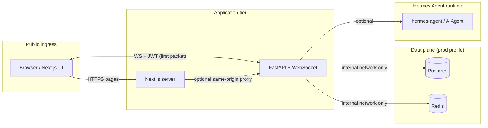

# Hermes-Agent: Industrial-Grade Web UI for High-Performance LLM Orchestration

> **A production-oriented reference UI for [NousResearch/hermes-agent](https://github.com/NousResearch/hermes-agent)** — built for teams who refuse to choose between **latency**, **security**, and **ship velocity**.

[](#license)
[](#reliability--ci-evidence)
[](apps/api/tests)
[](#performance--compliance)

**Languages:** **English** is the canonical README (SSOT). **Full Simplified Chinese mirror:** [README.zh-CN.md](README.zh-CN.md) · [In-page summary](#中文文档)

**Why this exists — in three lines**

- **60FPS-class UX** — long reasoning traces stay smooth via buffered rendering and **virtualized lists** once the trace exceeds **500 lines**.
- **Zero-trust multi-tenant isolation** — **JWT scoped access**, **session–owner binding**, and **sandboxed HTML artifacts** are first-class, not bolt-ons.
- **One-click deploy** — **Docker Compose** profiles separate **Demo** (time-to-wow) from **Prod** (**secure by default**: non-root, internal data plane, health-gated startup).

---

## Table of contents

- [Why Hermes-Agent UI](#why-hermes-agent-ui)
- [3-minute quickstart](#3-minute-quickstart)
- [Performance & compliance](#performance--compliance)
- [Architecture](#architecture)
- [Scope matrix (A2)](#scope-matrix-a2)
- [Deployment guide — production & secure-by-default](#deployment-guide--production--secure-by-default)
- [Developer reference](#developer-reference)
- [Reliability & CI evidence](#reliability--ci-evidence)
- [Roadmap](#roadmap)
- [Contributing](#contributing)
- [License](#license)
- [中文文档](#中文文档) · [README.zh-CN.md](README.zh-CN.md)

---

## Why Hermes-Agent UI

### High-performance virtualization (500+ reasoning steps)

Agent UIs usually die by a thousand small re-renders. Hermes-Agent UI treats the **Reasoning Trace** as a **stream**, not a naive React list:

- **Inbound frame batching** coalesces bursty WebSocket traffic before paint.
- **`requestAnimationFrame`-aligned flushes** keep the main thread responsive under load.
- **Windowed rendering** activates automatically when trace lines exceed **500**, so **O(n) DOM** never scales with step count.

The result: the interface stays **interactive** while the model keeps thinking.

### Zero-trust multi-tenant security

- **JWT on the WebSocket first packet** and **`Authorization: Bearer`** for HTTP — one shared `get_current_user` dependency, no duplicated auth logic.
- **`session_id` ↔ `user_id` ownership** in SQLite (`session_owners`) — replay and persistence are **owner-scoped**.
- **Scoped capabilities** (`admin:stats:read`, `benchmark:run`) enforced with **`require_scope()`** — least privilege by default.
- **HTML artifacts** carry a **zero-privilege policy**; the UI only renders HTML inside a **sandboxed iframe** when the contract is satisfied. Server-side hardening blocks dangerous tags and oversized payloads.

### Industrial-grade session resilience

- **Structured frames** (`THOUGHT`, `TOOL_CALL`, `ARTIFACT`, `RESPONSE`, `STATUS`, `ERROR`, …) with monotonic **`seq`**.
- **Server-side replay persistence** (SQLite) + client **`resume_from_seq`** — reconnect without losing narrative continuity.
- **Heartbeats + exponential backoff reconnect** on the client — the chat feels alive even on flaky networks.

---

## 3-minute quickstart

> **Goal:** open the UI, click **Demo Templates**, and see **response + reasoning + artifacts** in under three minutes — no yak-shaving.

### Option A — Demo mode (zero-friction, auth off)

Copy env defaults, build, run:

```bash
cp .env.example.docker .env && docker compose --profile demo up --build
```

Then:

1. Open **`http://localhost:3000`**
2. Click any **Demo Templates** chip under the input
3. Watch the **Reasoning Trace** and **Artifacts** panes update in real time

**Endpoints**

| Surface | URL |
| --- | --- |
| Web UI | `http://localhost:3000` |
| API health | `http://localhost:8000/health` |
| Agent WebSocket | `ws://localhost:8000/ws/agent` |

### Option B — Production mode (secure by default)

> Use this when you are shipping to **DevOps / SRE** audiences: **JWT on**, **Postgres + Redis** on an **internal Docker network**, **API/Web** still exposed only where you intend.

```bash
cp .env.example.docker .env
# Edit .env: set COMPOSE_PROFILES=prod, real secrets, NEXT_PUBLIC_AGENT_AUTH_TOKEN, OPENAI_API_KEY, etc.
docker compose --profile prod up --build
```

**Prod checklist (minimum)**

- Set **`HERMES_UI_JWT_SECRET`** to a strong random value.
- Set **`NEXT_PUBLIC_AGENT_AUTH_TOKEN`** at **image build time** (Next.js embeds public env vars).
- Set **`POSTGRES_PASSWORD`**, **`DATABASE_URL`**, **`REDIS_URL`** to non-default values.

---

## Performance & compliance

### Data-driven benchmarks (reference architecture)

Numbers below reflect **typical behavior** on a modern laptop (Chrome, virtualization enabled, Diagnostics panel sampling). **Your hardware will vary** — reproduce with `pnpm perf:baseline` and the in-app **Diagnostics** drawer.

| Metric | Target / typical | Notes |
| --- | --- | --- |
| **Avg FPS** (UI thread, 60s window) | **59+** | With virtualization path active for long traces |
| **Jank index** (dropped frame proxy) | **Low** | `dropped_frames` / `dropped_avg_60s` in Diagnostics |
| **P95 frame parse latency** (client) | **< 4 ms** | Dominated by `JSON.parse` + batching, not layout thrash |
| **Long-session memory** (browser tab) | **< 200 MB** | With trace windowing + capped client frame retention |
| **Synthetic throughput** | **45+ FPS-equivalent** | `pnpm perf:baseline` gate (`HERMES_BENCH_MIN_FPS_EQ`, default `45`) |

> **Honest engineering note:** treat this table as a **contract with your CI**, not a marketing guarantee. The repo ships **automated gates** and **artifact reports** so performance regressions are **diff-visible**.

### Security checklist (what we enforce in code & Compose)

| Control | Status |
| --- | --- |
| **Non-root** API & Web container users | Yes (`docker/api.Dockerfile`, `docker/web.Dockerfile`) |
| **Internal backend network** for Postgres & Redis | Yes (`networks.backend.internal: true` in `docker-compose.yml`) |
| **JWT scoped access** + explicit `require_scope()` | Yes (`apps/api/auth_dependency.py`, `apps/api/main.py`) |
| **Session owner binding** | Yes (`session_owners` + WS gate before replay) |
| **Unauthenticated metadata leakage** on `/replay/stats` | Blocked (401 when auth enabled) |
| **Log rotation** (disk exhaustion guard) | Yes (`json-file`, `max-size` / `max-file` in Compose) |
| **HTML artifact sandbox contract** | Yes (server policy + client iframe rules) |

---

## Architecture



**Frame flow (simplified)**

1. Client opens **`/ws/agent`**, sends **`WsRequest`** with **`auth_token`**, **`session_id`**, optional **`resume_from_seq`**.
2. Server **authenticates before replay**; binds **`session_id`** to **`user_id`**; streams structured frames; **persists** eligible frames for replay.
3. UI **batches** incoming frames and **virtualizes** long traces; **Artifacts** render under **security policy**.

---

## Scope matrix (A2)

| Capability | Required scope | Typical user | Admin |
| --- | --- | --- | --- |
| `GET /replay/stats` (self-scoped) | Authenticated | Allowed | Allowed |
| `GET /replay/stats` (global) | `admin:stats:read` | Denied | Allowed |
| WS `/benchmark` stress stream | `benchmark:run` | Denied | Allowed if granted |
| Regular chat / reasoning / artifacts | Authenticated | Allowed | Allowed |

Unauthenticated callers **must not** receive replay metadata (`/replay/stats`).

---

## Deployment guide — production & secure-by-default

> **The `prod` Compose profile is designed as secure-by-default for operators:** non-root services, an **internal bridge** for Postgres/Redis, health-gated dependencies, and **bounded container logs**.

**Before you expose this to the internet**

1. **Rotate all secrets** — especially **`HERMES_UI_JWT_SECRET`** and database passwords.
2. **Set `NEXT_PUBLIC_AGENT_AUTH_TOKEN`** at **build** time for the Web image when auth is on.
3. **Prefer RS256 at scale** — HS256 is fine for a single issuer; multi-service verification usually wants asymmetric keys and a JWKS endpoint.
4. **Persist state intentionally** — Postgres and Redis use named volumes in `prod`; map replay SQLite to a volume if you need durable session history across container restarts (today’s compose uses ephemeral `/tmp/runtime.db` for the API — **change `HERMES_UI_DB_PATH` + mount a volume** for durability).
5. **Keep the data plane internal** — only **API:8000** and **Web:3000** should be published; Postgres/Redis stay on **`backend`**.
6. **Forward logs** — Compose rotation prevents disk death spirals; ship JSON logs to your aggregator for SRE workflows.

---

## Developer reference

### Repository layout

| Path | Role |
| --- | --- |
| `apps/web` | Next.js 14 (App Router, TS, Tailwind, Zustand, TanStack Query) |
| `apps/api` | FastAPI + structured Hermes streaming + replay persistence |
| `packages/config` | Shared UI strings / constants |
| `docker/` | Production-oriented Dockerfiles |
| `scripts/` | `perf-baseline.mjs`, `demo-golden.mjs` |

### Local dev (without Docker)

**Web**

```bash
pnpm install
pnpm dev:web
```

**API**

```bash
cd apps/api
python -m venv .venv
.venv\Scripts\activate   # Windows
pip install -r requirements.txt
uvicorn main:app --reload --host 0.0.0.0 --port 8000
```

Copy `apps/api/.env.example` → `.env` as needed.

### Replay persistence

- Default DB path: `apps/api/runtime.db` (local dev); override with **`HERMES_UI_DB_PATH`**.
- Client sends **`resume_from_seq`**; server replays frames with **`seq > resume_from_seq`**.
- TTL: **`HERMES_UI_REPLAY_RETENTION_HOURS`** (default `24`).
- Cap per replay request: **`HERMES_UI_MAX_REPLAY_FRAMES`** (default `2000`).
- Artifact cap: **`HERMES_UI_MAX_ARTIFACT_CHARS`** (default `20000`, suffix `[TRUNCATED_BY_SERVER]`).

### Authentication & session isolation

- WebSocket first packet: **`auth_token`** (JWT, HS256 today).
- Enable with **`HERMES_UI_AUTH_ENABLED=1`** and set **`HERMES_UI_JWT_SECRET`**, issuer, audience.
- **`session_id`** is bound to **`user_id`** in **`session_owners`**; mismatches → **`SESSION_FORBIDDEN`**.

### Prompt modularization

- `apps/api/prompt_service.py` + Jinja2 templates under `apps/api/templates/`.

### Artifact security contract

- Payload includes **`security_policy`** (`zero-privilege` sandbox).
- HTML: server blocks dangerous tags / oversize content; client only iframe-renders when policy matches.

### Performance tooling

- **`pnpm perf:baseline`** — JSON report + optional CI gate (`HERMES_BENCH_*` env vars).
- **`pnpm demo:golden`** — multi-prompt golden path report (`HERMES_DEMO_*`).
- **`/benchmark`** requires **`benchmark:run`** scope when auth is enabled.

---

## Reliability & CI evidence

| Workflow | Purpose |
| --- | --- |
| `.github/workflows/perf-baseline.yml` | Scheduled / manual performance gate + JSON artifacts |
| `.github/workflows/demo-golden.yml` | Golden multi-prompt demo + API log artifact |

**Tests**

- `apps/api/tests/` — unit, auth, scope, **WebSocket e2e resilience** (`test_e2e_ws_resilience.py`).

---

## Roadmap

- Durable replay volume mapping in `prod` as a first-class documented path.
- Optional RS256 / JWKS verification for multi-service deployments.
- Richer Hermes event mapping as upstream APIs evolve.

---

## Contributing

Contributions welcome — please keep changes focused, match existing patterns, and extend tests when touching auth, replay, or streaming.

## License

MIT — see `LICENSE` if present, or add one when you publish.

---

## 中文文档

> **大厂常见双语策略：** 技术细节与接口以 **英文 README（上文）为 SSOT**；**完整简体中文镜像** 单独维护，避免单文件过长、双语文本交错难 diff。

**→ 完整中文版请阅读 [README.zh-CN.md](README.zh-CN.md)**（与英文目录结构对齐的全文翻译）。

**速览：** 面向 [NousResearch/hermes-agent](https://github.com/NousResearch/hermes-agent) 的工业级 Web UI；**Demo** 一条命令 `cp .env.example.docker .env && docker compose --profile demo up --build`，打开 `http://localhost:3000` 点 **Demo Templates**；**Prod** 见英文 [Deployment guide](#deployment-guide--production--secure-by-default)。许可与英文 [License](#license) 一致（MIT）。
