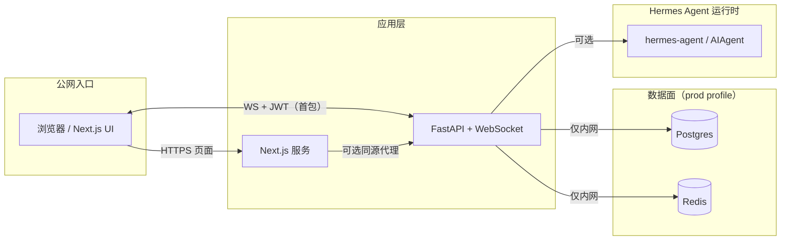

# Hermes-Agent：面向高性能 LLM 编排的工业级 Web UI

> **面向 [NousResearch/hermes-agent](https://github.com/NousResearch/hermes-agent) 的生产级参考 UI** —— 为不愿在 **延迟**、**安全** 与 **交付速度** 之间妥协的团队而设计。

[](#许可证)
[](#可靠性与-ci-证据)
[](apps/api/tests)
[](#性能与合规)

**语言：** 规范文档以 **[English README](README.md)**（SSOT）为准；本文件为 **简体中文全文镜像**，与英文结构一一对应，便于国内团队阅读与对内同步。

**存在的意义 —— 三句话**

- **60FPS 量级体验** —— 长推理 Trace 通过缓冲渲染与 **超过 500 行自动虚拟列表** 保持流畅。
- **零信任多租户隔离** —— **JWT 范围权限**、**会话归属绑定**、**沙箱化 HTML 产物** 是一等公民，非事后补丁。
- **一键部署** —— **Docker Compose** 双 profile：**Demo**（快速惊艳）与 **Prod**（**默认安全**：非 root、内网数据面、健康检查串联启动）。

---

## 目录

- [为何选择 Hermes-Agent UI](#为何选择-hermes-agent-ui)
- [三分钟上手](#三分钟上手)
- [性能与合规](#性能与合规)
- [架构](#架构)
- [权限矩阵（A2）](#权限矩阵a2)
- [部署指南 —— 生产与默认安全](#部署指南--生产与默认安全)
- [开发者参考](#开发者参考)
- [可靠性与 CI 证据](#可靠性与-ci-证据)
- [路线图](#路线图)
- [贡献](#贡献)
- [许可证](#许可证)

---

## 为何选择 Hermes-Agent UI

### 高性能虚拟化（500+ 推理步）

多数 Agent 界面死于细碎重渲染。本 UI 将 **推理 Trace** 视为 **流**，而非朴素列表：

- **入站帧批量合并**，在绘制前吸收突发 WebSocket 流量。
- **与 `requestAnimationFrame` 对齐的刷新**，高负载下仍保持主线程响应。
- **窗口化渲染** 在 Trace 行数超过 **500** 时自动启用，**DOM 规模不随步数线性增长**。

结果：模型持续思考时，界面仍可 **交互**。

### 零信任多租户安全

- WebSocket **首包 JWT** + HTTP **`Authorization: Bearer`** —— 共享 `get_current_user` 依赖，鉴权逻辑不重复。
- SQLite **`session_owners`** 实现 **`session_id` ↔ `user_id`** —— 回放与持久化 **按属主隔离**。
- **范围能力**（`admin:stats:read`、`benchmark:run`）经 **`require_scope()`** 强制 —— 默认最小权限。
- **HTML 产物** 携带 **零权限策略**；仅当契约满足时，UI 在 **沙箱 iframe** 内渲染。服务端加固拦截危险标签与超大负载。

### 工业级会话韧性

- **结构化帧**（`THOUGHT`、`TOOL_CALL`、`ARTIFACT`、`RESPONSE`、`STATUS`、`ERROR`…）与单调递增 **`seq`**。
- **服务端回放持久化**（SQLite）+ 客户端 **`resume_from_seq`** —— 重连不断叙事。
- 客户端 **心跳 + 指数退避重连** —— 弱网下聊天仍「活着」。

---

## 三分钟上手

> **目标：** 三分钟内打开 UI，点击 **Demo Templates**，看到 **回复 + 推理 + 产物** —— 无需折腾环境。

### 方案 A —— Demo 模式（零摩擦，关闭鉴权）

```bash
cp .env.example.docker .env && docker compose --profile demo up --build
```

然后：

1. 打开 **`http://localhost:3000`**
2. 在输入框下方点击任意 **Demo Templates**
3. 观察 **推理 Trace** 与 **Artifacts** 面板实时更新

**端点**

| 用途 | URL |
| --- | --- |
| Web UI | `http://localhost:3000` |
| API 健康检查 | `http://localhost:8000/health` |
| Agent WebSocket | `ws://localhost:8000/ws/agent` |

### 方案 B —— 生产模式（默认安全）

> 面向 **DevOps / SRE**：**JWT 开启**，**Postgres + Redis** 位于 **Docker 内部网络**，**API/Web** 仅在你期望的位置暴露。

```bash
cp .env.example.docker .env
# 编辑 .env：COMPOSE_PROFILES=prod，填写真实密钥、NEXT_PUBLIC_AGENT_AUTH_TOKEN、OPENAI_API_KEY 等
docker compose --profile prod up --build
```

**Prod 最低检查项**

- **`HERMES_UI_JWT_SECRET`** 使用高强度随机值。
- **`NEXT_PUBLIC_AGENT_AUTH_TOKEN`** 在 **构建镜像时** 注入（Next.js 将 public 变量打入前端）。
- **`POSTGRES_PASSWORD`**、**`DATABASE_URL`**、**`REDIS_URL`** 不使用默认值。

---

## 性能与合规

### 数据驱动的基准（参考架构）

下表反映 **现代笔记本 + Chrome + 开启虚拟化 + Diagnostics 采样** 下的 **典型表现**。**实际因硬件而异** —— 请用 `pnpm perf:baseline` 与应用内 **Diagnostics** 复现。

| 指标 | 目标 / 典型 | 说明 |
| --- | --- | --- |
| **平均 FPS**（UI 线程，60s 窗口） | **59+** | 长 Trace 走虚拟化路径时 |
| **卡顿指数**（丢帧代理） | **低** | Diagnostics 中 `dropped_frames` / `dropped_avg_60s` |
| **P95 帧解析延迟**（客户端） | **< 4 ms** | 主要由 `JSON.parse` + 批处理主导，非布局抖动 |
| **长会话内存**（浏览器标签页） | **< 200 MB** | Trace 窗口化 + 客户端帧数上限 |
| **合成吞吐** | **45+ FPS 当量** | `pnpm perf:baseline` 门槛（`HERMES_BENCH_MIN_FPS_EQ`，默认 `45`） |

> **工程诚实声明：** 将此表视为与 **CI 的契约**，而非营销承诺。仓库提供 **自动化门禁** 与 **制品报告**，使性能回退 **在 diff 中可见**。

### 安全清单（代码与 Compose 已落实）

| 控制项 | 状态 |
| --- | --- |
| API / Web **非 root** 容器用户 | 是（`docker/api.Dockerfile`、`docker/web.Dockerfile`） |
| Postgres / Redis **内部后端网络** | 是（`docker-compose.yml` 中 `networks.backend.internal: true`） |
| **JWT 范围权限** + 显式 `require_scope()` | 是（`apps/api/auth_dependency.py`、`apps/api/main.py`） |
| **会话属主绑定** | 是（`session_owners` + 回放前 WS 校验） |
| 未鉴权访问 **`/replay/stats` 泄露元数据** | 拦截（鉴权开启时 401） |
| **日志轮转**（防磁盘打满） | 是（Compose `json-file`、`max-size` / `max-file`） |
| **HTML 产物沙箱契约** | 是（服务端策略 + 客户端 iframe 规则） |

---

## 架构



**帧流（简化）**

1. 客户端连接 **`/ws/agent`**，发送含 **`auth_token`**、**`session_id`**、可选 **`resume_from_seq`** 的 **`WsRequest`**。
2. 服务端 **先于回放完成鉴权**；将 **`session_id`** 绑定 **`user_id`**；流式输出结构化帧；对可回放帧 **持久化**。
3. UI **批量** 处理入站帧，长 Trace **虚拟化**；**Artifacts** 在 **安全策略** 下渲染。

---

## 权限矩阵（A2）

| 能力 | 所需 scope | 普通用户 | 管理员 |
| --- | --- | --- | --- |
| `GET /replay/stats`（本人范围） | 已认证 | 允许 | 允许 |
| `GET /replay/stats`（全局） | `admin:stats:read` | 拒绝 | 允许 |
| WS `/benchmark` 压测流 | `benchmark:run` | 拒绝 | 授权则允许 |
| 常规对话 / 推理 / 产物 | 已认证 | 允许 | 允许 |

未鉴权调用者 **不得** 获取 replay 元数据（`/replay/stats`）。

---

## 部署指南 —— 生产与默认安全

> **`prod` Compose profile 面向运维默认安全：** 非 root 服务、Postgres/Redis **内部 bridge**、依赖 **健康检查** 串联、**容器日志有界**。

**在公网暴露前**

1. **轮换全部密钥** —— 尤其 **`HERMES_UI_JWT_SECRET`** 与数据库密码。
2. 鉴权开启时，在 **构建** Web 镜像阶段设置 **`NEXT_PUBLIC_AGENT_AUTH_TOKEN`**。
3. **规模化优先 RS256** —— 单 issuer 下 HS256 可用；多服务校验通常需要非对称密钥与 JWKS。
4. **有意识的持久化** —— `prod` 中 Postgres/Redis 使用命名卷；若需跨容器重启保留 replay，请为 SQLite 配置 **`HERMES_UI_DB_PATH` + volume**（当前 compose 中 API 使用临时路径时需自行调整）。
5. **数据面保持内网** —— 仅发布 **API:8000** 与 **Web:3000**；Postgres/Redis 留在 **`backend`** 网络。
6. **转发日志** —— Compose 轮转避免磁盘死循环；将 JSON 日志送入集中观测平台以支持 SRE。

---

## 开发者参考

### 仓库结构

| 路径 | 职责 |
| --- | --- |
| `apps/web` | Next.js 14（App Router、TS、Tailwind、Zustand、TanStack Query） |
| `apps/api` | FastAPI + Hermes 结构化流式 + 回放持久化 |
| `packages/config` | 共享 UI 文案与常量 |
| `docker/` | 面向生产的 Dockerfile |
| `scripts/` | `perf-baseline.mjs`、`demo-golden.mjs` |

### 本地开发（无 Docker）

**Web**

```bash
pnpm install
pnpm dev:web
```

**API**

```bash
cd apps/api
python -m venv .venv
# Windows: .venv\Scripts\activate
# macOS/Linux: source .venv/bin/activate
pip install -r requirements.txt
uvicorn main:app --reload --host 0.0.0.0 --port 8000
```

按需复制 `apps/api/.env.example` → `.env`。

### 回放持久化

- 默认路径：`apps/api/runtime.db`（本地开发）；用 **`HERMES_UI_DB_PATH`** 覆盖。
- 客户端发送 **`resume_from_seq`**；服务端回放 **`seq > resume_from_seq`** 的帧。
- TTL：**`HERMES_UI_REPLAY_RETENTION_HOURS`**（默认 `24`）。
- 单次回放上限：**`HERMES_UI_MAX_REPLAY_FRAMES`**（默认 `2000`）。
- 产物大小上限：**`HERMES_UI_MAX_ARTIFACT_CHARS`**（默认 `20000`，截断后缀 `[TRUNCATED_BY_SERVER]`）。

### 认证与会话隔离

- WebSocket 首包：**`auth_token`**（JWT，当前 HS256）。
- **`HERMES_UI_AUTH_ENABLED=1`** 并配置 **`HERMES_UI_JWT_SECRET`**、issuer、audience。
- **`session_id`** 与 **`user_id`** 绑定于 **`session_owners`**；不一致 → **`SESSION_FORBIDDEN`**。

### 提示词模块化

- `apps/api/prompt_service.py` + `apps/api/templates/` 下 Jinja2 模板。

### 产物安全契约

- 载荷含 **`security_policy`**（`zero-privilege` 沙箱）。
- HTML：服务端拦截危险标签/超大内容；客户端仅在策略匹配时 iframe 渲染。

### 性能工具

- **`pnpm perf:baseline`** —— JSON 报告 + 可选 CI 门禁（`HERMES_BENCH_*`）。
- **`pnpm demo:golden`** —— 多提示词黄金路径报告（`HERMES_DEMO_*`）。
- **`/benchmark`** 在鉴权开启时需要 **`benchmark:run`** scope。

---

## 可靠性与 CI 证据

| Workflow | 用途 |
| --- | --- |
| `.github/workflows/perf-baseline.yml` | 定时/手动性能门禁 + JSON 制品 |
| `.github/workflows/demo-golden.yml` | 黄金多提示词演示 + API 日志制品 |

**测试**

- `apps/api/tests/` —— 单元、鉴权、scope、**WebSocket 端到端韧性**（`test_e2e_ws_resilience.py`）。

---

## 路线图

- 将 `prod` 下 **持久化 replay 卷** 作为一等文档路径。
- 可选 **RS256 / JWKS**，支撑多服务部署。
- 随上游演进丰富 Hermes 事件映射。

---

## 贡献

欢迎贡献 —— 请保持改动聚焦、遵循现有风格；涉及鉴权、回放或流式传输时请补充测试。

## 许可证

MIT —— 若仓库根目录尚无 `LICENSE` 文件，请在公开发布前补齐。与 [English README](README.md#license) 一致。
